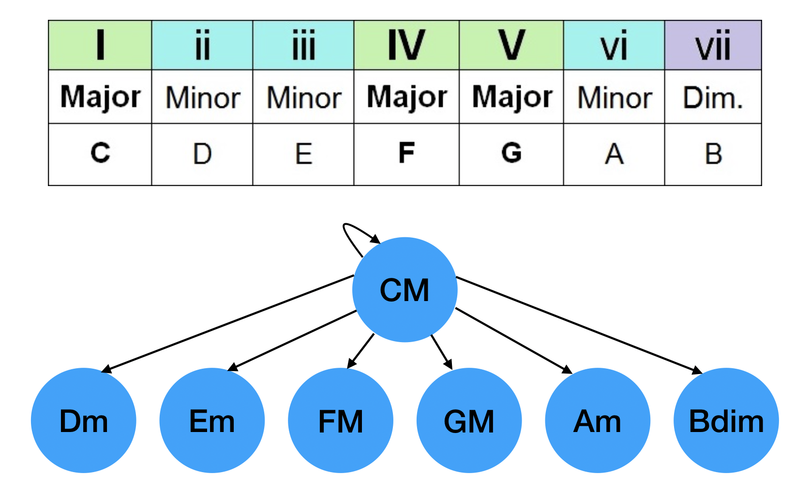

# Music Graph Theory

In music, chords have Roman Numerals, or chords related to it by its own key.
If we think of a chord as being connected to each of these other chords,
we can create a directed graph using graph theory.  

Above is the graph for just one chord, but each of those connected chords
would also have another six chords connected to it, and so on.
When you visualize the whole graph, you realize how many possibilities
there are for travel between two chords.  

To create the graph, I made a dictionary with chords as keys, and a dictionary
of Roman Numeral chords for the value.  

For instance, the key "CM" would get you
the dictionary {1: CM, 2: Dm, 3: Em, 4: FM, 5: GM, 6: Am, 7: Bdim}

&nbsp;

Run main.py to hear what the depth first and breadth first searches from
Fm to Edim would sound like.
Experiment and pick different sets of chords!

Note: Diminished chords can be the end of a search but not the beginning.
They are a dead end on the directed graph.
